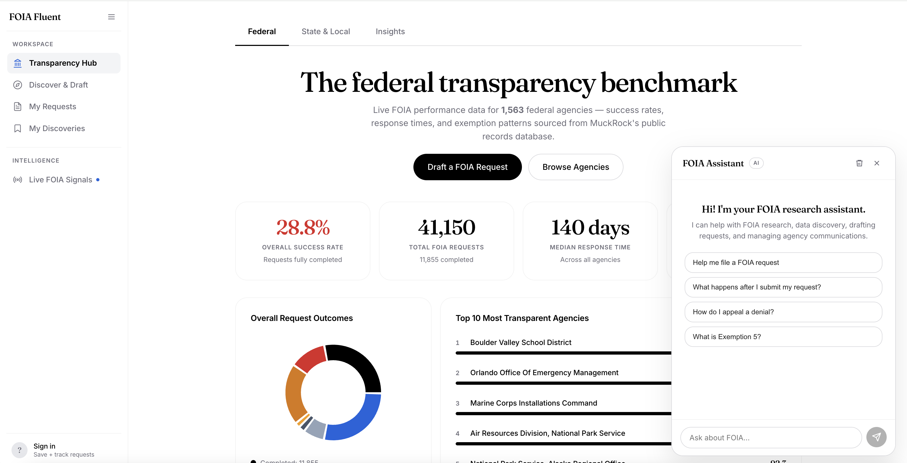
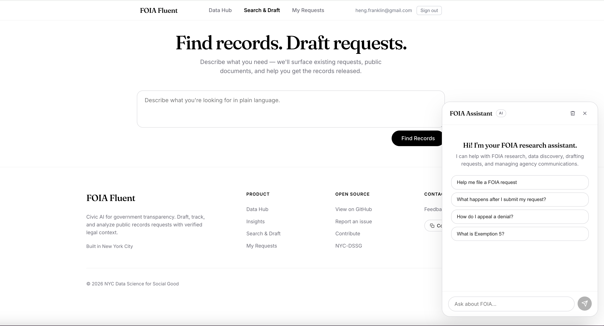
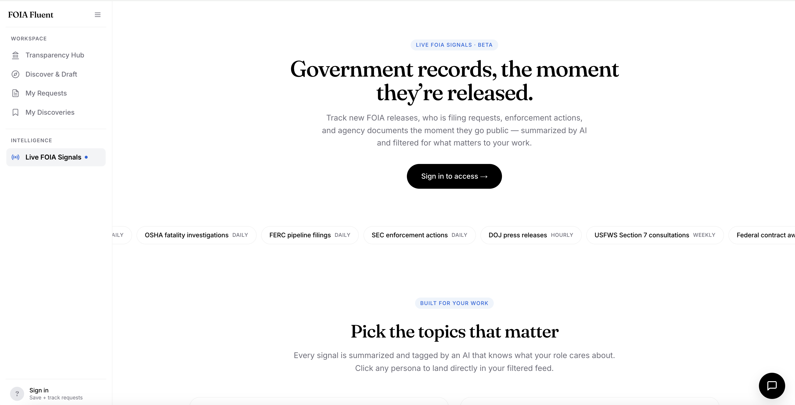
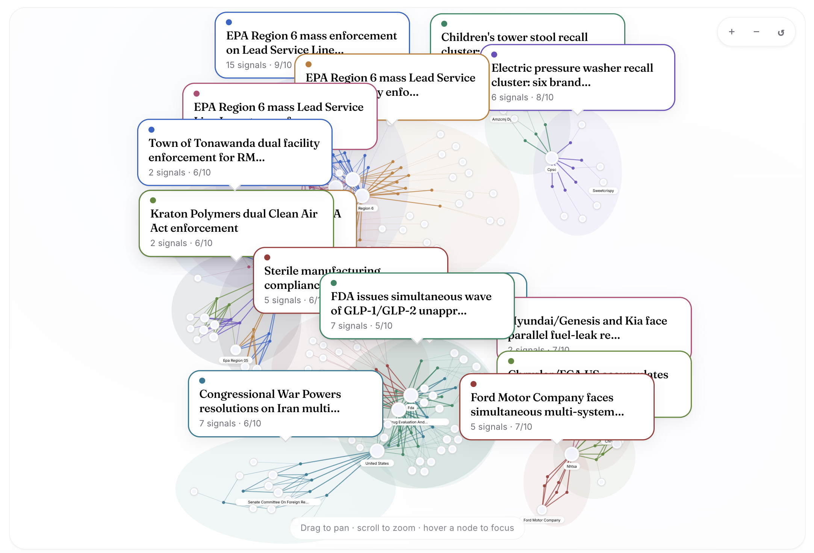

# FOIA Fluent

FOIA Fluent is an open source civic AI platform that helps journalists, lawyers, researchers, and concerned citizens find public records, file optimized Freedom of Information Act requests, track agency responses, and surface real time government activity. This repository contains the full FastAPI backend, Next.js frontend, Supabase schema, a registry driven ingest pipeline that pulls from 19 federal sources daily, and the code powering the [live site](https://www.foiafluent.com).

<p align="center">
  
</p>
<p align="center"><sub><b>Homepage</b>: entry point to Discover and Draft, Transparency Hub, Live FOIA Signals, My Requests, and the AI chat assistant.</sub></p>

<p align="center">
  
</p>
<p align="center"><sub><b>Discover and Draft</b>: unified search across MuckRock, DocumentCloud, and the open web. Detail pane drives Save, Track, or Draft actions.</sub></p>

<p align="center">
  
</p>
<p align="center"><sub><b>Live FOIA Signals</b>: real time feed aggregating 19 federal sources with AI detected cross source patterns.</sub></p>

<p align="center">
  
</p>
<p align="center"><sub><b>Pattern galaxy</b>: each cluster is one Claude detected cross source pattern. Nodes are signals (colored by cluster) and shared entities (companies, agencies, people, locations). Click a cluster to open an in page drawer with the narrative and full evidence timeline.</sub></p>

---

## Table of contents

- [Why this exists](#why-this-exists)
- [Discover and Draft](#discover-and-draft)
- [My Discoveries](#my-discoveries)
- [Saved Searches](#saved-searches)
- [My Requests](#my-requests)
- [Live FOIA Signals](#live-foia-signals)
- [Transparency Hub: Federal Agencies](#transparency-hub-federal-agencies)
- [Transparency Hub: State and Local](#transparency-hub-state-and-local)
- [Transparency Hub: Insights](#transparency-hub-insights)
- [AI Chat Assistant](#ai-chat-assistant)
- [Navigation](#navigation)
- [Architecture](#architecture)
- [Repository layout](#repository-layout)
- [Quick start](#quick-start)
- [Tech stack](#tech-stack)
- [Data refresh scripts](#data-refresh-scripts)
- [Deployment](#deployment)
- [Key data sources](#key-data-sources)
- [Who it is for](#who-it-is-for)
- [Contributing](#contributing)
- [Get in touch](#get-in-touch)

---

## Why this exists

The Freedom of Information Act promises government transparency, but in practice the process is broken: public documents are scattered across dozens of repositories with no unified search, every jurisdiction has different rules, and requests fail at high rates because they are filed against the wrong agency, cite the wrong statute, or use vague scope. FOIA Fluent addresses these gaps in a single platform that unifies discovery across public document sources, drafts requests grounded in verified statute and agency context, tracks responses per user with deadline monitoring, and surfaces a real time feed of government activity that reveals FOIA worthy stories.

The problems this project is meant to solve:

- **Documents exist but are scattered.** Public records sit across MuckRock, DocumentCloud, agency reading rooms, and the open web with no unified search.
- **Jurisdictions differ.** Federal FOIA, New York FOIL, California CPRA, and Texas PIA each have unique exemptions, deadlines, appeal processes, and fee structures.
- **Requests fail at high rates.** Poorly worded requests, wrong agencies, missing legal citations, and vague scope give agencies easy reasons to deny or delay.
- **No shared intelligence.** Journalists, lawyers, and civic organizations each reinvent the wheel.
- **The process is opaque.** Response timelines stretch from weeks to years, improper redactions go unchallenged, and most people give up.

The information belongs to the public. The process should not be this hard.

---

## Discover and Draft

Three pane discovery engine that searches across MuckRock, DocumentCloud, and the open web, then generates FOIA request letters grounded in verified legal context.

- **Query interpretation via Claude.** The input is parsed into relevant agencies, record types, and an intent summary.
- **Automatic agency identification.** Claude identifies the best federal agency and returns alternatives with reasoning.
- **Three pane results layout.** Left filter rail (source, year, type, sort), unified compact row list, persistent right detail pane with Save, Track, Open, and Note actions.
- **Drafting grounded in verified context.** Each draft pulls from three layers of verified context: statute text, agency CFR regulations from eCFR, and MuckRock outcomes. The model cannot cite law from its training data.
- **Agency intelligence research.** Successful, denied, and exemption related FOIA outcomes for the target agency inform drafting strategy.
- **AI interpretability.** A "How We Built This Draft" section shows what the model learned and which strategies it applied.

Entry points: [frontend/src/app/draft/page.tsx](frontend/src/app/draft/page.tsx), [backend/app/routes/draft.py](backend/app/routes/draft.py), [backend/app/services/drafter.py](backend/app/services/drafter.py), [backend/app/services/search.py](backend/app/services/search.py).

---

## My Discoveries

Persistent per user library of documents saved from discovery results, with full lifecycle management.

- **Save from results.** One click save from the discovery detail pane.
- **Status tracking.** Mark discoveries as saved, reviewed, useful, or not useful.
- **Notes and tags.** Annotate and organize saved documents.
- **Link to tracked requests.** Connect discoveries to FOIA requests for a unified research trail.
- **Three pane library.** Same Gmail style layout as Discover and Draft, with filters by status, source, and tags.

Entry points: [frontend/src/app/discoveries/page.tsx](frontend/src/app/discoveries/page.tsx), [backend/app/routes/discoveries.py](backend/app/routes/discoveries.py), [backend/app/services/discoveries.py](backend/app/services/discoveries.py).

---

## Saved Searches

Save and reopen discovery queries with cached result snapshots.

- **Result snapshots.** The full discovery response is stored at save time, so clicking a saved search hydrates instantly without re running the pipeline.
- **Sidebar integration.** Saved searches appear in the left sidebar on every page.
- **Refresh on demand.** Re run the discovery pipeline and update the snapshot when fresh results are needed.
- **Visible to all users.** Signed out users see the feature as a teaser. Signed in users get full functionality.

Entry points: [backend/app/routes/saved_searches.py](backend/app/routes/saved_searches.py), [backend/app/services/saved_searches.py](backend/app/services/saved_searches.py), [frontend/src/lib/saved-searches-api.ts](frontend/src/lib/saved-searches-api.ts).

---

## My Requests

Track submitted requests from filing to resolution with response analysis and letter generation by Claude.

- **Supabase backed persistence with Row Level Security.** Each user sees only their own requests.
- **OTP authentication.** Email based sign in via Supabase Auth.
- **Deadline monitoring.** Calculates the 20 business day statutory deadline, skipping weekends and federal holidays.
- **Response analysis.** Claude evaluates agency responses for completeness, validates each exemption cited, identifies missing records, and recommends next steps.
- **Appeal and follow up letter generation.** Letters are generated directly from the communication timeline.
- **Import existing requests.** Bring in flight FOIA requests into the system with full research pipeline analysis.
- **Linked discoveries.** View documents from the discovery library that are connected to a tracked request.

Entry points: [frontend/src/app/dashboard/page.tsx](frontend/src/app/dashboard/page.tsx), [frontend/src/app/requests](frontend/src/app/requests), [backend/app/routes/tracking.py](backend/app/routes/tracking.py).

---

## Live FOIA Signals

Real time intelligence feed aggregating government activity across 19 federal sources, with a Claude detected pattern engine that surfaces cross source narratives.

### Ingest

- **19 federal sources** spanning enforcement, recalls, courts, contracts, ethics, and policy. Coverage includes GAO bid protests and reports, EPA ECHO, FDA warning letters and recalls, USDA FSIS recalls, NHTSA recalls, CPSC recalls, IRS news, IG reports, CIGIE aggregator, SEC EDGAR litigation, FEC enforcement, DOJ press, White House actions, Congress.gov bills, CourtListener federal opinions, regulations.gov dockets, SAM.gov contracts, Senate LDA lobbying, and DHS FOIA logs extracted from PDFs by Claude multimodal.
- **Single source registry.** Adding a source is one entry in [backend/app/data/signals_sources.py](backend/app/data/signals_sources.py). No new cron jobs and no new scripts.
- **Six fetch strategies.** RSS, HTML scrape, JSON API, CSV bulk download, sitemap crawl, and PDF vision. Each strategy lives in [backend/app/services/ingest](backend/app/services/ingest) and is selected by the `fetch_strategy` field on each `SourceConfig`.
- **Auto scheduling.** A 60 minute asyncio loop in [backend/app/main.py](backend/app/main.py) ticks the dispatcher in [backend/app/services/ingest/runner.py](backend/app/services/ingest/runner.py). Sources self gate by their per source `cadence_minutes`. No external cron service.
- **Pattern detection runs inline after ingest.** When a tick ingests new signals, pattern detection fires automatically with a 12 hour debounce. No polling loop and no threshold guesswork.

### Categorization

- **20 category taxonomy.** Categories are the data primitive on each signal (`agency_enforcement`, `drug_recalls`, `court_opinions`, `legislation`, ...). Defined in [backend/app/data/signal_categories.py](backend/app/data/signal_categories.py).
- **Personas as bundles.** Seven personas (journalist, pharma analyst, hedge fund, environmental, policy researcher, legal analyst, consumer safety) are named bundles of categories. Selecting a persona expands to its underlying categories in the feed and pattern engine.
- **Entity resolution.** Per signal extraction of companies, agencies, people, locations, and regulations. Slugified entities link cross source so a company's full activity is one click away.

### Pattern engine

- **Seven pattern types.** Compounding risk, coordinated activity, trend shift, convergence, regulatory cascade, recall to litigation, oversight to action. Each type encodes a different cross source narrative shape (temporal ordering, agency handoff, post recall litigation, IG to enforcement chain).
- **60 day lookback, 400 signal corpus.** Wide enough to catch slow burning narratives, capped to keep cost predictable.
- **Per run dedup context.** The last seven days of pattern titles are passed to Claude as already seen so the dashboard does not fill with duplicates.
- **Cost ceiling.** One run costs roughly $0.50 on Sonnet 4.6, capped to one run per ingest cycle. Roughly $15 per month at daily cadence.

### Dashboard

- **Three tier number hierarchy.** Global counts (all time signals, visible patterns, sources enabled) at the top; current view counts (patterns connecting N signals over the last 60 days) above the galaxy; loaded view counts (filtered signal count, time window, ingested today) above the feed.
- **Pattern galaxy.** Force directed graph rendered with d3 force. Each pattern is a colored cluster, with shared entity nodes that bridge clusters when the same company or agency appears in multiple patterns. Pan, scroll zoom, and pinch zoom on touch.
- **In page pattern drawer.** Clicking a cluster opens a right side drawer with the narrative and full evidence timeline. The galaxy isolates to the selected cluster while the drawer is open. ESC, click outside, or click the X closes.
- **Lead and grid feed.** The highest priority signal per day renders as a lead card with full summary; the rest of that day renders as a two column compact grid. Day labels are absolute dates (`Today · Apr 25`, `Yesterday · Apr 24`, weekday for the last week, then date for older).
- **Source filter pills.** Multi select chips with category tinting, synced between the galaxy and the feed.

Entry points: [frontend/src/app/signals](frontend/src/app/signals), [frontend/src/components/SignalsDashboard.tsx](frontend/src/components/SignalsDashboard.tsx), [frontend/src/components/PatternGraph.tsx](frontend/src/components/PatternGraph.tsx), [frontend/src/components/PatternDetailDrawer.tsx](frontend/src/components/PatternDetailDrawer.tsx), [backend/app/routes/signals.py](backend/app/routes/signals.py), [backend/app/services/signals.py](backend/app/services/signals.py), [backend/app/scripts/refresh_signal_patterns.py](backend/app/scripts/refresh_signal_patterns.py).

---

## Transparency Hub: Federal Agencies

Public transparency dashboard surfacing aggregated FOIA data across 1,600+ federal agencies.

- **Transparency Score.** Composite of success rate (40%), response speed (30%), fee rate (15%), and portal availability (15%).
- **Interactive charts.** Outcome breakdown and top and bottom agency rankings.
- **Searchable directory.** Paginated, sortable table with key metrics.
- **Per agency deep dives.** Outcome pie chart, score breakdown, exemption patterns, success and denial patterns.
- **Weekly refresh.** MuckRock data is cached in Supabase via [backend/app/scripts/refresh_hub_stats.py](backend/app/scripts/refresh_hub_stats.py).

---

## Transparency Hub: State and Local

Interactive choropleth map of state level FOIA transparency across 54 state jurisdictions and thousands of agencies.

- **Interactive US map.** States are color coded by transparency score, with hover tooltips and click to drill down.
- **State detail pages.** Per state stats, outcome charts, top and bottom agency rankings, and searchable agency directory.
- **Jurisdiction scoped agency routing.** Paths such as `/hub/states/california/department-of-education` avoid slug conflicts across jurisdictions.
- **Data pipeline.** [backend/app/scripts/refresh_jurisdiction_stats.py](backend/app/scripts/refresh_jurisdiction_stats.py) fetches from the MuckRock API.

---

## Transparency Hub: Insights

Deep FOIA analysis using government authoritative data from FOIA.gov annual reports (FY 2008 to 2024).

- **FOIA at a Glance.** Hero stats with year over year change indicators.
- **Request Volume Trends.** Area chart showing received, processed, and backlog over 17 years.
- **Transparency Trends.** Stacked area chart of full grant, partial grant, and denial rates over time.
- **Most Requested Agencies.** Horizontal bar chart of the top 15 agencies.
- **Exemption Patterns.** Most cited exemptions with descriptions.
- **Processing Times.** Median days for simple versus complex requests over time.
- **Costs and Staffing.** Total FOIA costs and cost per request trends.
- **Appeals and Litigation.** Appeal volume and litigation cases over time.
- **AI News Digest.** Claude curated FOIA news from 10 RSS feeds, categorized and summarized.
- **Data pipeline.** [backend/app/scripts/refresh_insights_data.py](backend/app/scripts/refresh_insights_data.py) fetches the FOIA.gov XML API; [backend/app/scripts/refresh_news_digest.py](backend/app/scripts/refresh_news_digest.py) generates AI summaries.

---

## AI Chat Assistant

Persistent FOIA research assistant on every page with tool use, a four tier accuracy system, and anti hallucination safeguards.

- **Floating chat panel.** Appears on every page, can be minimized, and toggles with Cmd+K.
- **Eleven tools.** Lookup exemptions, search agencies, query user's requests, search web (trusted and broad), search MuckRock, query hub stats, search user's saved discoveries, read a saved document's content, and query the signals feed.
- **Four tier accuracy system.** Instant local lookup, trusted domain search, deep research agent, graceful fallback with resource links.
- **Auto escalation.** Upgrades from Haiku to Sonnet and broadens search when trusted sources do not have the answer.
- **Read only.** The chat cannot modify any database records. Enforced at code level.
- **Grounded in tool results.** Every fact must come from a tool result or verified reference data. Sources are cited as clickable chips.
- **Platform expert.** Guides users through Discover and Draft, My Requests, and Transparency Hub rather than giving generic advice.
- **Context aware.** Knows which page the user is on and adapts guidance accordingly.
- **SSE streaming.** Real time response with thinking dots, tool call indicators, and incremental text.

Entry points: [frontend/src/components/ChatPanel.tsx](frontend/src/components/ChatPanel.tsx), [backend/app/routes/chat.py](backend/app/routes/chat.py), [backend/app/services/chat.py](backend/app/services/chat.py), [backend/app/services/chat_tools.py](backend/app/services/chat_tools.py), [docs/chat-architecture.md](docs/chat-architecture.md).

---

## Navigation

Left sidebar with a collapsible icon strip, profile block, and saved searches list.

- **Workspace section.** Transparency Hub, Discover and Draft, My Requests, and My Discoveries with inline SVG icons.
- **Intelligence section.** Live FOIA Signals with a live pulse indicator.
- **Saved Searches section.** Clickable list that deep links into cached discovery results. Visible to all users, including signed out.
- **Profile block.** Avatar initial, email, and sign out dropdown pinned to the bottom.
- **Collapsed mode.** 64 pixel icon strip with tooltips. State is persisted in localStorage.
- **Mobile.** Drawer behind a hamburger button with scrim overlay.

Entry points: [frontend/src/components/Sidebar.tsx](frontend/src/components/Sidebar.tsx), [frontend/src/app/layout.tsx](frontend/src/app/layout.tsx).

---

## Architecture

```
Frontend (Next.js 14)          Backend (FastAPI)              External Services
┌──────────────────┐          ┌──────────────────────┐       ┌─────────────────┐
│                  │   HTTP   │                      │       │ Claude API      │
│  Transparency Hub│ ──────>  │  Chat Orchestrator   │ ────> │ (Haiku + Sonnet)│
│  Discover & Draft│          │  Discovery Pipeline  │       │                 │
│  My Requests     │   SSE    │  FOIA Drafter        │       │ Tavily Search   │
│  My Discoveries  │ <──────  │  Agency Intel Agent  │       │                 │
│  FOIA Signals    │          │  Response Analyzer   │       │ MuckRock API    │
│  Chat Panel      │          │  Letter Generator    │       │ FOIA.gov API    │
│  Left Sidebar    │          │  Signals Ingestion   │       │ DocumentCloud   │
│                  │          │  Discoveries Service │       │ eCFR API        │
│                  │          │  Chat Tools (11)     │       │ EPA ECHO        │
└──────────────────┘          └──────────────────────┘       └─────────────────┘
                                        │
                              ┌─────────▼─────────────┐
                              │      Supabase         │
                              │ PostgreSQL + Auth     │
                              │ + Row Level Security  │
                              └───────────────────────┘
```

---

## Repository layout

```
FOIA-Fluent/
├── backend/                             FastAPI server
│   ├── app/
│   │   ├── main.py                      ASGI entrypoint, router registration, signals dispatcher loop
│   │   ├── config.py                    Settings from environment variables
│   │   ├── middleware/                  Supabase JWT auth extraction
│   │   ├── models/                      Pydantic request and response schemas
│   │   ├── routes/                      HTTP routes (draft, tracking, hub, signals, chat, admin, ...)
│   │   ├── services/                    Business logic (drafter, search, chat, signals, ...)
│   │   │   └── ingest/                  Per strategy fetchers (rss, html, json_api, csv_bulk, pdf_vision) and the runner
│   │   ├── scripts/                     Data refresh, signals backfill, persona seed, pattern engine
│   │   └── data/                        Reference data and registries
│   │       ├── signals_sources.py       Source registry: 19 SourceConfig entries
│   │       ├── signal_categories.py     20 category taxonomy and 7 persona bundles
│   │       └── federal_agencies.py      Federal agency reference data
│   ├── supabase_schema.sql              Database schema and RLS policies
│   └── requirements.txt                 Python dependencies
├── frontend/                            Next.js 14 app
│   ├── src/
│   │   ├── app/                         App Router pages
│   │   │   ├── draft/                   Discover and Draft
│   │   │   ├── discoveries/             My Discoveries library
│   │   │   ├── dashboard/               My Requests
│   │   │   ├── requests/[id]/           Request detail
│   │   │   ├── hub/                     Transparency Hub (federal, states, insights)
│   │   │   ├── signals/                 Live FOIA Signals dashboard, patterns, entity pages
│   │   │   ├── admin/                   Admin signals health dashboard
│   │   │   └── layout.tsx               Root layout with sidebar and chat
│   │   ├── components/                  Sidebar, ChatPanel, SignalsDashboard, PatternGraph, drawers
│   │   └── lib/                         API clients and Supabase auth
│   ├── package.json
│   └── next.config.js
├── docs/
│   ├── images/                          README screenshots
│   ├── chat-architecture.md             Chat assistant reference
│   └── chat-upgrade-guide-unredacted.md Chat implementation guide
├── README.md
└── SKILLS.md                            README authoring style guide
```

---

## Quick start

The fastest path to a running local environment.

### Prerequisites

- Python 3.11 or newer
- Node.js 18 or newer
- API keys for Anthropic (Claude) and Tavily
- Optional: a Supabase project for auth and persistence, and a FOIA.gov API key for the Insights page

### Setup

```bash
# Clone
git clone https://github.com/dssg-nyc/FOIA-Fluent.git
cd FOIA-Fluent

# Backend
cd backend
python -m venv .venv
source .venv/bin/activate
pip install -r requirements.txt
cp ../.env.example .env   # Edit with your API keys

uvicorn app.main:app --reload --port 8000

# Frontend (new terminal)
cd frontend
npm install
npm run dev
```

Open [http://localhost:3000](http://localhost:3000).

### Environment variables

```
# Required
ANTHROPIC_API_KEY=         # Claude API
TAVILY_API_KEY=            # Web search

# Required for auth and persistence (optional for local dev without accounts)
SUPABASE_URL=
SUPABASE_SERVICE_KEY=
SUPABASE_JWT_SECRET=

# Optional
FOIA_GOV_API_KEY=          # FOIA.gov annual report data

# Frontend (.env.local)
NEXT_PUBLIC_API_URL=
NEXT_PUBLIC_SUPABASE_URL=
NEXT_PUBLIC_SUPABASE_ANON_KEY=
```

---

## Tech stack

**Backend**
- FastAPI (Python), async native, SSE streaming, Pydantic validation
- Supabase (PostgreSQL and Auth), RLS, OTP auth

**Frontend**
- Next.js 14 (React 18, TypeScript), App Router, SSR
- Recharts and react simple maps for charts and the state map

**AI and search**
- Claude API (Haiku 4.5 default, Sonnet 4.6 escalation, Sonnet 4.6 for pattern detection and PDF vision), tool use, 200K context
- Tavily API for domain scoped web search

**Infrastructure**
- Railway for the backend, Vercel for the frontend
- GitHub for source control under [dssg-nyc](https://github.com/dssg-nyc)

---

## Data refresh scripts

Scripts live under [backend/app/scripts](backend/app/scripts). Run them from the `backend` directory with the virtualenv activated.

```bash
# Federal agency transparency stats (weekly)
python -m app.scripts.refresh_hub_stats

# State and local jurisdiction stats (weekly)
python -m app.scripts.refresh_jurisdiction_stats

# FOIA.gov annual report data for Insights (annual)
python -m app.scripts.refresh_insights_data

# AI news digest (weekly)
python -m app.scripts.refresh_news_digest
```

For Live FOIA Signals, the in process dispatcher in [backend/app/main.py](backend/app/main.py) ticks every 60 minutes in production and runs every source whose `cadence_minutes` has elapsed. Manual triggers are still available for development and one off backfills.

```bash
# Run every source whose cadence is due (same code path the dispatcher uses)
python -m app.scripts.run_due_sources

# Run a single source by source_id from the registry, ignoring cadence
python -m app.scripts.run_source fda_warning_letters

# Pattern engine: regenerate cross source patterns over the recent corpus
python -m app.scripts.refresh_signal_patterns

# Seed the personas table from PERSONA_BUNDLES (idempotent, safe to re run)
python -m app.scripts.seed_personas

# One off: tag every existing signal with category_tags using Haiku
python -m app.scripts.backfill_category_tags
```

---

## Deployment

- **Backend.** Deploy to Railway with root directory `backend/` and the environment variables above.
- **Frontend.** Deploy to Vercel with root directory `frontend/` and the `NEXT_PUBLIC_*` environment variables.
- **Database.** Run [backend/supabase_schema.sql](backend/supabase_schema.sql) in the Supabase SQL Editor. Seed agencies with `python -m app.scripts.seed_agency_profiles`.
- **Auth redirect.** Add the Vercel URL to Supabase Auth redirect URLs so OTP sign in completes.

---

## Key data sources

| Source | What it provides |
|---|---|
| [MuckRock](https://www.muckrock.com) | FOIA requests, agency response data, outcome intelligence |
| [FOIA.gov](https://www.foia.gov) | Annual report data (FY 2008 to 2024) for 100+ federal agencies |
| [DocumentCloud](https://www.documentcloud.org) | Searchable repository of public interest documents |
| [Tavily](https://tavily.com) | Domain scoped web search |
| [eCFR](https://www.ecfr.gov) | Verbatim CFR regulation text for 52 federal agencies |
| [EPA ECHO](https://echo.epa.gov) | Environmental enforcement and compliance data |

---

## Who it is for

- **Journalists** investigating government activity and needing documents fast.
- **Lawyers and legal organizations** filing records requests on behalf of clients.
- **Researchers and academics** studying government policy, enforcement, and spending.
- **Civic organizations and nonprofits** holding agencies accountable.
- **Concerned citizens** exercising their right to public information.

---

## Contributing

This project is open source under [dssg-nyc](https://github.com/dssg-nyc). Contributions are welcome. Open an issue to discuss a feature or bug, or open a pull request against `main`. The [Quick start](#quick-start) section above covers the local setup needed to test changes before submitting.

---

## Get in touch

For questions, feedback, or collaboration: **[heng.franklin@gmail.com](mailto:heng.franklin@gmail.com)**.
