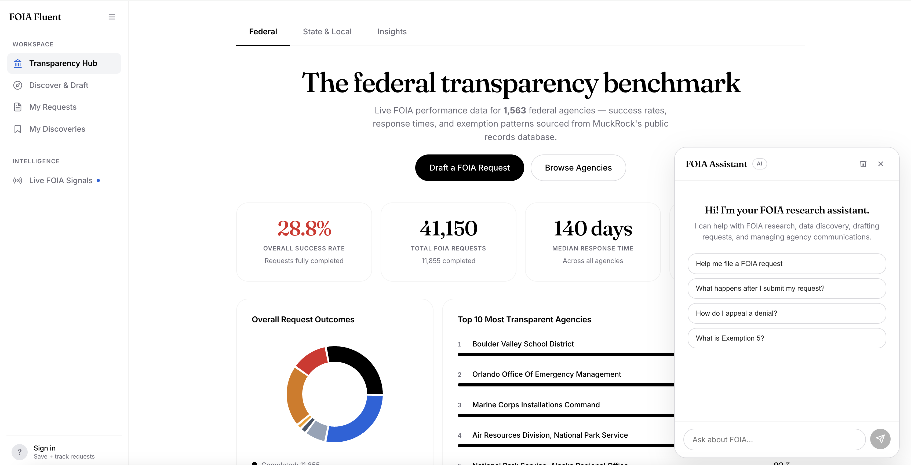
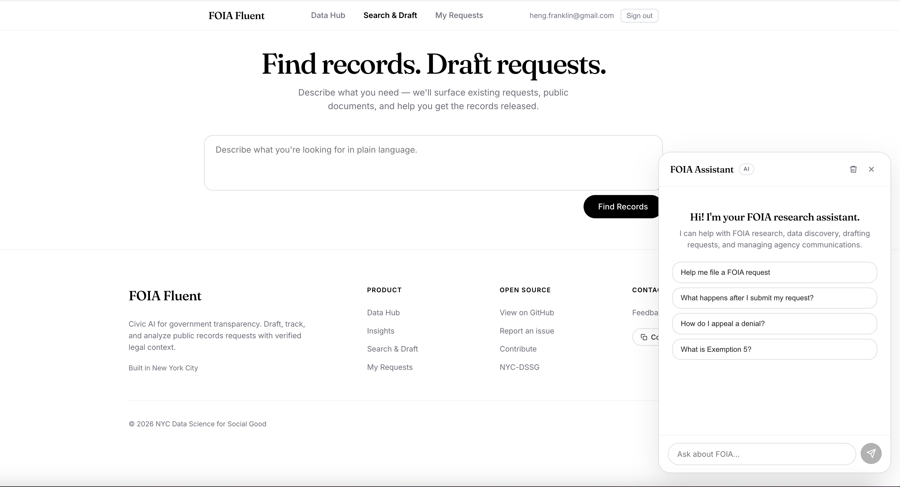
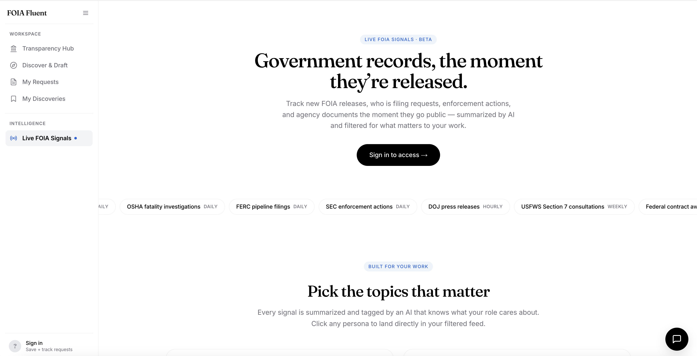
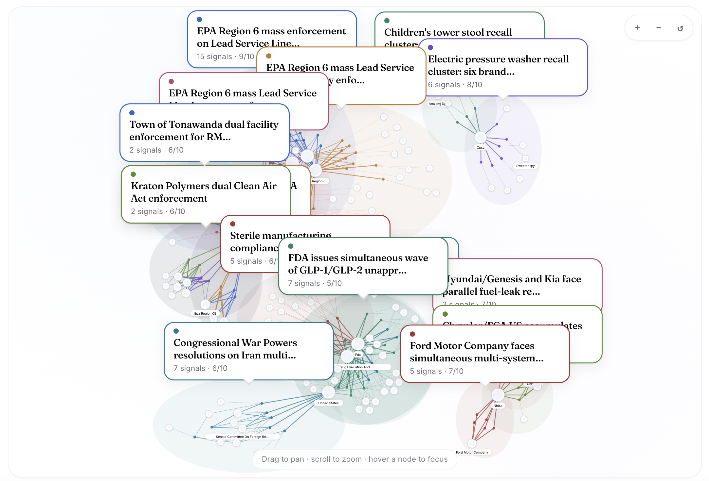

# FOIA Fluent

FOIA Fluent is a web application for discovering, drafting, filing, and tracking Freedom of Information Act requests, backed by verified statute and regulation text. This repository contains the FastAPI backend, the Next.js frontend, the Supabase schema, and the ingest and refresh scripts that power a live federal records signals feed.

<p align="center">
  
</p>
<p align="center"><sub><b>Homepage</b>: the marketing landing page. It reads the Supabase session to swap the primary call to action between sign in and the Transparency Hub.</sub></p>

<table align="center">
  <tr>
    <td align="center" valign="middle"></td>
    <td align="center" valign="middle"></td>
  </tr>
  <tr>
    <td align="center" valign="top"><sub><b>Discover and Draft</b>: free text query to interpreted intent, agency identification, multi source discovery, and a grounded FOIA letter.</sub></td>
    <td align="center" valign="top"><sub><b>Agency intelligence</b>: transparency scores, denial patterns, success patterns, and exemption tendencies pulled from MuckRock outcome data.</sub></td>
  </tr>
</table>

<p align="center">
  
</p>
<p align="center"><sub><b>Pattern graph</b>: the Live FOIA Signals pattern engine renders detected cross source patterns as a force directed graph of signals and entities.</sub></p>

---

## Table of contents

- [Why this exists](#why-this-exists)
- [Discover and Draft](#discover-and-draft)
- [My Discoveries](#my-discoveries)
- [Saved Searches](#saved-searches)
- [My Requests](#my-requests)
- [Live FOIA Signals](#live-foia-signals)
- [Transparency Hub](#transparency-hub)
- [AI Chat Assistant](#ai-chat-assistant)
- [Navigation](#navigation)
- [Architecture](#architecture)
- [Repository layout](#repository-layout)
- [Quick start](#quick-start)
- [Tech stack](#tech-stack)
- [Data refresh scripts](#data-refresh-scripts)
- [Deployment](#deployment)
- [Key data sources](#key-data-sources)
- [Who it is for](#who-it-is-for)
- [Contributing](#contributing)
- [Get in touch](#get-in-touch)

---

## Why this exists

Filing a useful FOIA request is hard. A requester has to identify the right agency, cite the correct statute and regulation, scope the records to avoid a denial, and then track a 20 business day deadline across follow ups and appeals. Most tools either generate generic letters from training data or stop at a template.

FOIA Fluent grounds every legal claim in verified source text. The drafter cites only the FOIA statute text held in [backend/app/data/federal_foia_statute.py](backend/app/data/federal_foia_statute.py) and the verbatim eCFR regulation text stored per agency. It surfaces what actually happened to similar past requests so the scope reflects real agency behavior rather than a guess.

---

## Discover and Draft

The Discover and Draft pipeline turns a free text question into a filed ready FOIA letter. The pipeline lives in [backend/app/services/search.py](backend/app/services/search.py) and [backend/app/services/drafter.py](backend/app/services/drafter.py).

The flow runs in stages:

```
free text query
  → interpret intent              (query_interpreter.py, claude-haiku-4-5-20251001)
  → identify agency               (drafter.py, claude-haiku-4-5-20251001)
  → parallel discovery            (DocumentCloud, Tavily public records, MuckRock via Tavily)
  → research similar requests     (Tavily scoped to muckrock.com)
  → generate grounded letter      (drafter.py, claude-sonnet-4-6)
  → DiscoveryResponse + draft
```

Query interpretation in [backend/app/services/query_interpreter.py](backend/app/services/query_interpreter.py) uses `claude-haiku-4-5-20251001` to classify intent and rewrite the query into source specific searches. It returns `intent`, `foia_queries`, `document_queries`, `public_records_queries`, `agencies`, and `record_types` as JSON.

Agency identification also uses `claude-haiku-4-5-20251001`. It may only recommend an agency that exists in the agency list and prefers a specific sub agency over its parent.

The drafter assembles three grounding layers before generating a letter with `claude-sonnet-4-6`:

1. Verified FOIA statute text from [backend/app/data/federal_foia_statute.py](backend/app/data/federal_foia_statute.py), sourced from the Office of the Law Revision Counsel.
2. Verbatim eCFR regulation text held in the `cfr_text` field of each agency profile, seeded by [backend/app/scripts/seed_agency_profiles.py](backend/app/scripts/seed_agency_profiles.py).
3. MuckRock outcome intelligence from the agency intel agent in [backend/app/services/agency_intel.py](backend/app/services/agency_intel.py), which runs three parallel Tavily searches scoped to muckrock.com and caches results for 24 hours.

Anti hallucination rules instruct the model to cite only statutes and regulations present in the verified context, never invent agency contact information, and say so when the context lacks a relevant citation. The draft returns a five field `drafting_strategy` object that explains how it learned from successful requests, what it avoided from denials, its scope decisions, and the exemptions the agency commonly invokes.

Supporting services for the request lifecycle:

- [backend/app/services/deadline_calculator.py](backend/app/services/deadline_calculator.py) computes the 20 business day deadline under 5 U.S.C. 552(a)(6)(A), skipping weekends and a hardcoded set of federal holidays for 2025 through 2027.
- [backend/app/services/response_analyzer.py](backend/app/services/response_analyzer.py) analyzes an agency response with `claude-sonnet-4-6`, assessing each cited exemption as valid, questionable, or invalid and recommending an action.
- [backend/app/services/letter_generator.py](backend/app/services/letter_generator.py) generates follow up letters with `claude-haiku-4-5-20251001` and appeal letters with `claude-sonnet-4-6`.
- [backend/app/services/request_analyzer.py](backend/app/services/request_analyzer.py) assesses an existing letter that a user imports rather than rewriting it.
- [backend/app/services/file_processor.py](backend/app/services/file_processor.py) converts uploaded PDF, image, TIFF, DOCX, and text attachments into Claude content blocks for multimodal analysis.

---

## My Discoveries

My Discoveries is a per user library of documents saved from the Discover and Draft search. The service is [backend/app/services/discoveries.py](backend/app/services/discoveries.py) and rows live in the `discovered_documents` Supabase table.

A saved document records its source (`muckrock`, `documentcloud`, or `web`), title, URL, agency, status (`saved`, `reviewed`, `useful`, or `not_useful`), a user note, and tags. Saving is idempotent on the pair of user and URL, so re saving a document updates it rather than duplicating. A discovery can be linked to a tracked request. The chat assistant can search this library and read the full extracted text of a saved document.

---

## Saved Searches

Saved Searches stores discovery queries so a user can re open them instantly. The service is [backend/app/services/saved_searches.py](backend/app/services/saved_searches.py) and rows live in the `saved_searches` Supabase table.

Saving is idempotent on the normalized query, which is trimmed and lowercased. A re save updates `last_run_at`, `last_result_count`, the cached AI interpretation, and an optional full `result_snapshot` of the `DiscoveryResponse` for instant re open. The list endpoint strips the heavy snapshot column so the sidebar stays light.

---

## My Requests

My Requests is the tracking dashboard for filed FOIA requests. The route is [backend/app/routes/tracking.py](backend/app/routes/tracking.py), and there are two interchangeable persistence backends with identical interfaces.

- [backend/app/services/supabase_store.py](backend/app/services/supabase_store.py) is the deployed backend. It uses the Supabase service key and scopes every query by `user_id`.
- [backend/app/services/request_store.py](backend/app/services/request_store.py) is the local development backend. It reads and writes a JSON file at [backend/app/data/tracked_requests.json](backend/app/data/tracked_requests.json) with no user scoping.

A tracked request carries its full research context as JSONB: the agency profile, the drafted letter, key elements, tips, similar requests, the drafting strategy, agency intel, and discovery results. Each request stores a chronological communications log and Claude generated response analyses. The recommended action from an analysis drives the request status. A request can be marked submitted, generate a follow up or appeal letter, and move through the states from `draft` to `fulfilled`.

---

## Live FOIA Signals

Live FOIA Signals aggregates federal records activity into one feed and detects cross source patterns. The single source of truth for sources is the registry in [backend/app/data/signals_sources.py](backend/app/data/signals_sources.py).

### Source registry

The registry is a Python dictionary of `SourceConfig` entries. Adding a source means adding one entry, with no new cron jobs and no new scripts. The registry holds **19 federal sources** across four families: enforcement, recalls, research, and courts. Each `SourceConfig` declares a `source_id`, `label`, `family`, `fetch_strategy`, a `fetch_config` dictionary, a `cadence_minutes` value, and per source caps such as `max_items_per_run` and `max_claude_calls_per_day`. There is no per source URL, category, or priority field. The URL lives inside `fetch_config`, categories come from the source default map in [backend/app/data/signal_categories.py](backend/app/data/signal_categories.py), and priority is extracted per signal by Claude.

The 19 sources include GAO bid protests, EPA ECHO enforcement, FDA warning letters, DHS FOIA logs, federal Inspector General reports, GAO reports, OSHA news, IRS news, openFDA drug, food, and device recalls, CPSC and NHTSA recalls, Congress.gov bills, Regulations.gov dockets, SEC and FTC press releases, CourtListener opinions, and FEC enforcement matters.

### Fetch strategies

Strategy modules live in [backend/app/services/ingest](backend/app/services/ingest). Each exposes an async `fetch` function. Five strategies are wired in the runner:

- [backend/app/services/ingest/rss.py](backend/app/services/ingest/rss.py) aggregates RSS and Atom feeds.
- [backend/app/services/ingest/html.py](backend/app/services/ingest/html.py) scrapes listing pages with regex link patterns and optional detail fetches.
- [backend/app/services/ingest/json_api.py](backend/app/services/ingest/json_api.py) paginates REST JSON APIs and substitutes API key placeholders at runtime.
- [backend/app/services/ingest/csv_bulk.py](backend/app/services/ingest/csv_bulk.py) downloads ZIP or CSV bulk files. Only EPA ECHO has a row builder.
- [backend/app/services/ingest/pdf_vision.py](backend/app/services/ingest/pdf_vision.py) sends scanned FOIA log PDFs to `claude-haiku-4-5-20251001` as document content blocks and extracts entries by forced tool use.

### Dispatcher and cadence

The production entry point is `run_due_sources` in [backend/app/services/ingest/runner.py](backend/app/services/ingest/runner.py), invoked both by the in process dispatcher in [backend/app/main.py](backend/app/main.py) on an hourly tick and by the [backend/app/scripts/run_due_sources.py](backend/app/scripts/run_due_sources.py) script. The dispatcher self gates: it reads the most recent non skipped run per source from `signals_source_runs` and skips any source whose cadence window has not elapsed. Each run writes a health row to `signals_source_runs`.

### Per signal extraction

Default per item extraction runs one forced tool use call to `claude-haiku-4-5-20251001` with the shared helper in [backend/app/scripts/_signals_common.py](backend/app/scripts/_signals_common.py). It returns a summary, structured entities, category tags drawn from the 20 category taxonomy, and a priority from 0 to 2. Category tags are unioned with the source default categories, and persona tags are derived from the category tags. Entity slugs are normalized into the `{type}:{slug}` format for cross signal resolution.

### Pattern engine

The pattern engine in [backend/app/scripts/refresh_signal_patterns.py](backend/app/scripts/refresh_signal_patterns.py) is the flagship feature. It runs one large forced tool use call to `claude-sonnet-4-6` over the most recent 400 signals from a 60 day window and detects up to 8 patterns of seven types: compounding risk, coordinated activity, trend shift, convergence, regulatory cascade, recall to litigation, and oversight to action. It fires at the end of any ingest tick that inserted at least one signal, with a 12 hour debounce.

Anti hallucination guards drop any pattern whose confidence is not high or medium, drop any pattern with fewer than two cited signals present in the corpus, and filter entity slugs to those that appear in the cited signals. Claude returns a non obviousness score from 0 to 10 as a self rating. Each pattern row carries a `visible` boolean that acts as a manual kill switch across every read path.

---

## Transparency Hub

The Transparency Hub benchmarks agency responsiveness. It has three views: federal, state and local, and insights. A single transparency score formula lives in [backend/app/scripts/scoring.py](backend/app/scripts/scoring.py) and produces a 0 to 100 score weighted as success rate 40 percent, response speed 30 percent, fee rate 15 percent, and portal availability 15 percent.

### Federal

The federal view ranks federal agencies by transparency score. Stats are refreshed weekly by [backend/app/scripts/refresh_hub_stats.py](backend/app/scripts/refresh_hub_stats.py), which pulls MuckRock agency data for the federal jurisdiction and upserts into the `agency_stats_cache` table. The read path is [backend/app/services/hub.py](backend/app/services/hub.py). The MuckRock universe holds roughly 1,694 federal agencies. The directory displays agencies with five or more requests. The static regulatory profile dictionary in [backend/app/data/federal_agencies.py](backend/app/data/federal_agencies.py) holds 52 agencies and serves as the CFR content fallback for `agency_profiles`.

### State and local

The state and local view fetches 54 jurisdictions, which are the 50 states plus DC, Puerto Rico, Guam, and the Virgin Islands. Stats are refreshed weekly by [backend/app/scripts/refresh_jurisdiction_stats.py](backend/app/scripts/refresh_jurisdiction_stats.py), which upserts into `jurisdiction_cache`, `agency_stats_cache`, and `jurisdiction_stats_cache`. The read path is [backend/app/services/jurisdictions.py](backend/app/services/jurisdictions.py), which serves a choropleth map and per jurisdiction detail. At the jurisdiction level the portal component awards its 15 points only when more than half of a state's agencies have a portal.

### Insights

The insights view presents 17 years of FOIA.gov annual report analytics, FY 2008 through FY 2024. Data is refreshed by [backend/app/scripts/refresh_insights_data.py](backend/app/scripts/refresh_insights_data.py), which reads the FOIA.gov annual report XML API and requires the `FOIA_GOV_API_KEY`. The read path is [backend/app/services/insights.py](backend/app/services/insights.py). It produces hero stats, volume trends, transparency trends, top agencies, exemption breakdowns, processing times, costs and staffing, and appeals and litigation counts. Two fields are permanent stubs: requester types returns an empty object and overturn rate is hardcoded to zero, because the source XML lacks the underlying breakdowns.

---

## AI Chat Assistant

The chat assistant is available on every page and toggles with Cmd+K or Ctrl+K. The orchestrator is [backend/app/services/chat.py](backend/app/services/chat.py) and the read only tools are in [backend/app/services/chat_tools.py](backend/app/services/chat_tools.py).

The assistant exposes 11 tools: `lookup_exemption`, `lookup_agency`, `search_web`, `search_web_broad`, `search_requests`, `get_request_detail`, `get_hub_stats`, `search_muckrock`, `search_my_discoveries`, `read_saved_document`, and `get_recent_signals`. Every database call is a select, so there is no write path. User scoped tools require a `user_id` and filter by it.

A four tier accuracy ladder governs escalation:

```
Tier 1  instant lookup        claude-haiku-4-5-20251001   local verified data
Tier 2  trusted web search    claude-haiku-4-5-20251001   search_web, 8 whitelisted domains
Tier 3  broad research        claude-sonnet-4-6           auto upgrade when search_web returns nothing
Tier 4  graceful fallback     (no call)                   verified answer not found, resource links
```

Escalation is backend driven. When `search_web` returns no results, the server upgrades the model to `claude-sonnet-4-6` and calls `search_web_broad`. The model does not decide to escalate. The endpoint is `POST /api/v1/chat` in [backend/app/routes/chat.py](backend/app/routes/chat.py) and streams server sent events of three types: `text`, `tool_call`, and `done`. Every tool result carries a `source` field, which the frontend renders as clickable citation chips.

---

## Navigation

The frontend is a Next.js App Router application. Most pages are client components that fetch from the backend over HTTP. The route gate is the Edge middleware in [frontend/src/middleware.ts](frontend/src/middleware.ts), which validates the Supabase session per request and redirects unauthenticated users to the login page.

Public paths are the landing page, login, and the auth callback. The Discover and Draft page is reachable without an account but requires sign in to track a request. The dashboard, request detail, discoveries, and import pages are gated by both the middleware and the client side guard in [frontend/src/components/AuthGuard.tsx](frontend/src/components/AuthGuard.tsx). Authentication uses Supabase email one time passcodes through the browser client in [frontend/src/lib/supabase.ts](frontend/src/lib/supabase.ts). All API modules read the backend base URL from `NEXT_PUBLIC_API_URL`.

---

## Architecture

```
                          foiafluent.com
                                │
                                ▼
        ┌───────────────────────────────────────────┐
        │  Vercel: Next.js 14 frontend (App Router)  │
        │  middleware.ts session gate                │
        └───────────────────────────────────────────┘
                                │  NEXT_PUBLIC_API_URL
                                │  Bearer <supabase jwt>
                                ▼
        ┌───────────────────────────────────────────┐
        │  Railway: FastAPI backend (uvicorn)         │
        │  routers mounted under /api/v1              │
        │  in process hourly signals dispatcher       │
        └───────────────────────────────────────────┘
             │              │               │
             ▼              ▼               ▼
        ┌─────────┐   ┌───────────┐   ┌──────────────┐
        │ Claude  │   │  Tavily   │   │  Supabase    │
        │ Sonnet  │   │  search   │   │  Postgres    │
        │ + Haiku │   │           │   │  + Auth      │
        └─────────┘   └───────────┘   └──────────────┘
                            │
                            ▼
        ┌───────────────────────────────────────────┐
        │  External data: MuckRock, DocumentCloud,    │
        │  openFDA, FOIA.gov, eCFR, GAO, EPA ECHO,     │
        │  Congress.gov, Regulations.gov, CourtListener│
        └───────────────────────────────────────────┘
```

The backend mounts 11 routers under the `/api/v1` prefix in [backend/app/main.py](backend/app/main.py): search, draft, tracking, admin, hub, jurisdictions, insights, chat, signals, discoveries, and saved searches. User authentication uses Supabase JWTs verified in [backend/app/middleware/auth.py](backend/app/middleware/auth.py). The admin endpoints are gated separately by an `ADMIN_SECRET`.

---

## Repository layout

```
FOIA-Fluent/
├── README.md
├── vercel.json                         # Vercel build config, roots at frontend/
├── .env.example                        # backend and frontend env vars in one file
├── backend/
│   ├── railway.toml                    # Railway build and deploy config
│   ├── Procfile                        # uvicorn start command
│   ├── requirements.txt
│   ├── supabase_schema.sql             # full Postgres schema with RLS policies
│   └── app/
│       ├── main.py                     # FastAPI app, routers, signals dispatcher
│       ├── config.py                   # pydantic settings, env var mapping
│       ├── middleware/
│       │   └── auth.py                 # Supabase JWT verification
│       ├── routes/                     # 11 routers under /api/v1
│       ├── services/                   # business logic
│       │   ├── search.py               # Discover pipeline
│       │   ├── drafter.py              # grounded letter generation
│       │   ├── agency_intel.py         # MuckRock outcome agent
│       │   ├── chat.py, chat_tools.py  # assistant orchestrator and tools
│       │   ├── signals.py              # signals read path and entity bios
│       │   ├── hub.py, jurisdictions.py, insights.py
│       │   ├── supabase_store.py       # deployed tracking backend
│       │   ├── request_store.py        # local JSON tracking backend
│       │   └── ingest/                 # signals fetch strategies and runner
│       ├── scripts/                    # refresh, seed, and backfill scripts
│       └── data/
│           ├── federal_foia_statute.py # verified FOIA statute text
│           ├── federal_agencies.py     # 52 agency regulatory profiles
│           ├── signals_sources.py      # 19 source registry
│           └── signal_categories.py    # 20 category taxonomy, 7 personas
├── frontend/
│   ├── package.json                    # Next.js 14.2.29
│   ├── next.config.js
│   └── src/
│       ├── middleware.ts               # Edge session gate
│       ├── app/                        # App Router pages
│       ├── components/                 # Sidebar, ChatPanel, pattern graph, etc.
│       └── lib/                        # one API module per backend area
└── docs/
    └── images/                         # README screenshots
```

---

## Quick start

Copy [.env.example](.env.example) and split it into `backend/.env` and `frontend/.env.local` as described by its comment headers.

Backend:

```bash
cd backend
python3 -m venv .venv
source .venv/bin/activate
pip install -r requirements.txt
uvicorn app.main:app --reload --port 8000
```

The backend runs without Supabase configured. When `SUPABASE_URL` is unset, the auth dependency returns a development user ID and tracking falls back to the local JSON store.

Frontend:

```bash
cd frontend
npm install
npm run dev
```

The frontend serves on port 3000 by default and calls the backend at `NEXT_PUBLIC_API_URL`.

---

## Tech stack

Backend:

- FastAPI 0.115.12 and uvicorn 0.34.3
- Pydantic 2 and pydantic-settings
- Anthropic SDK 0.52.0 for `claude-sonnet-4-6` and `claude-haiku-4-5-20251001`
- tavily-python for web and domain scoped search
- supabase 2.15.1 Python client
- PyJWT with crypto for JWT verification
- httpx, feedparser, python-docx, Pillow, python-multipart

Frontend:

- Next.js 14.2.29 with the App Router and React 18
- TypeScript 5
- @supabase/ssr and @supabase/supabase-js for cookie based auth
- recharts for charts
- react-simple-maps for the state choropleth
- d3-force for the pattern galaxy and graph
- @vercel/analytics

Data and infrastructure:

- Supabase Postgres with row level security and Supabase Auth
- Railway for the backend
- Vercel for the frontend

---

## Data refresh scripts

The scripts in [backend/app/scripts](backend/app/scripts) keep cached data current. Each refresh script writes a health row to `signals_source_runs`.

| Script | Purpose | Cadence |
|---|---|---|
| [run_due_sources.py](backend/app/scripts/run_due_sources.py) | Run all due signals sources through the dispatcher | hourly |
| [run_source.py](backend/app/scripts/run_source.py) | Run a single named signals source | on demand |
| [refresh_signal_patterns.py](backend/app/scripts/refresh_signal_patterns.py) | Detect cross source patterns with `claude-sonnet-4-6` | after any tick that inserted signals, 12 hour debounce |
| [refresh_hub_stats.py](backend/app/scripts/refresh_hub_stats.py) | Refresh federal agency stats from MuckRock | weekly |
| [refresh_jurisdiction_stats.py](backend/app/scripts/refresh_jurisdiction_stats.py) | Refresh state agency and jurisdiction stats | weekly |
| [refresh_insights_data.py](backend/app/scripts/refresh_insights_data.py) | Pull FOIA.gov annual report data | annual |
| [seed_agency_profiles.py](backend/app/scripts/seed_agency_profiles.py) | Seed agency profiles and eCFR regulation text | one time |
| [seed_personas.py](backend/app/scripts/seed_personas.py) | Upsert the 7 personas into the personas table | one time |
| [backfill_category_tags.py](backend/app/scripts/backfill_category_tags.py) | Re run Haiku to add category tags to existing rows | on demand |
| [backfill_default_tags.py](backend/app/scripts/backfill_default_tags.py) | Apply source default categories to empty rows | on demand |
| [backfill_entity_slugs.py](backend/app/scripts/backfill_entity_slugs.py) | Populate entity slugs from existing entities | on demand |

The per source scripts [refresh_signals_gao.py](backend/app/scripts/refresh_signals_gao.py), [refresh_signals_epa_echo.py](backend/app/scripts/refresh_signals_epa_echo.py), [refresh_signals_fda_warning_letters.py](backend/app/scripts/refresh_signals_fda_warning_letters.py), and [refresh_signals_dhs_foia_log.py](backend/app/scripts/refresh_signals_dhs_foia_log.py) are legacy. They are superseded by the registry and dispatcher.

---

## Deployment

The frontend deploys to Vercel. [vercel.json](vercel.json) roots the project at the repository root and builds with `cd frontend && npm run build`, outputting to `frontend/.next`. The custom domain is configured in the Vercel dashboard, not in repository files.

The backend deploys to Railway from the `backend/` directory. [backend/railway.toml](backend/railway.toml) uses the nixpacks builder, starts uvicorn against `app.main:app`, and health checks `/health`. The signals dispatcher runs in process on an hourly tick, so no separate cron service is required.

The frontend reaches the backend through `NEXT_PUBLIC_API_URL`. The backend allows the frontend origin through `BACKEND_CORS_ORIGINS`.

Backend environment variables defined in [backend/app/config.py](backend/app/config.py):

| Variable | Purpose |
|---|---|
| `ANTHROPIC_API_KEY` | Claude API access |
| `TAVILY_API_KEY` | web and domain scoped search |
| `SUPABASE_URL` | Supabase project URL |
| `SUPABASE_ANON_KEY` | Supabase anon key |
| `SUPABASE_SERVICE_KEY` | service role key used by the backend |
| `SUPABASE_JWT_SECRET` | HS256 token verification |
| `ADMIN_SECRET` | protects the admin endpoints |
| `BACKEND_CORS_ORIGINS` | allowed frontend origins |
| `MUCKROCK_BASE_URL` | MuckRock API base URL |
| `BACKEND_HOST`, `BACKEND_PORT` | local bind host and port |
| `FOIA_GOV_API_KEY` | FOIA.gov annual report API |
| `API_DATA_GOV_KEY` | unlocks Regulations.gov, FEC, and other federal APIs |
| `CONGRESS_GOV_API_KEY` | Congress.gov API |

Frontend environment variables:

| Variable | Purpose |
|---|---|
| `NEXT_PUBLIC_API_URL` | backend base URL |
| `NEXT_PUBLIC_SUPABASE_URL` | Supabase project URL |
| `NEXT_PUBLIC_SUPABASE_ANON_KEY` | Supabase anon key |

---

## Key data sources

| Source | What it provides | Where it is used |
|---|---|---|
| FOIA statute | verified 5 U.S.C. 552 text from the Office of the Law Revision Counsel | draft grounding in [federal_foia_statute.py](backend/app/data/federal_foia_statute.py) |
| eCFR | verbatim per agency FOIA regulation text | draft grounding via `cfr_text` |
| MuckRock | request outcomes and agency transparency stats | agency intel, Transparency Hub |
| DocumentCloud | published government documents | discovery results |
| Tavily | trusted domain and broad web search | discovery, agency intel, chat |
| FOIA.gov | annual report analytics, FY 2008 through 2024 | Insights |
| openFDA | drug, food, and device recalls | Live FOIA Signals |
| GAO, EPA ECHO, DHS, OSHA, IRS | enforcement and FOIA log signals | Live FOIA Signals |
| Congress.gov, Regulations.gov | bills and dockets | Live FOIA Signals |
| CourtListener, SEC, FTC, FEC, CPSC, NHTSA | opinions, press releases, enforcement, recalls | Live FOIA Signals |

---

## Who it is for

FOIA Fluent serves journalists, researchers, legal analysts, financial analysts, environmental advocates, and consumer safety advocates. The persona bundles in [backend/app/data/signal_categories.py](backend/app/data/signal_categories.py) map seven personas to the signal categories each cares about, so the Live FOIA Signals feed can be filtered to a reader's interest.

---

## Contributing

Adding a new signals source is a one entry change to the registry in [backend/app/data/signals_sources.py](backend/app/data/signals_sources.py), provided an existing fetch strategy covers its format. Adding a category requires editing the taxonomy in [backend/app/data/signal_categories.py](backend/app/data/signal_categories.py), updating at least one persona bundle, and running [backfill_category_tags.py](backend/app/scripts/backfill_category_tags.py). The Supabase schema is defined in [backend/supabase_schema.sql](backend/supabase_schema.sql).

---

## Get in touch

For questions or feedback: **[heng.franklin@gmail.com](mailto:heng.franklin@gmail.com)**.
